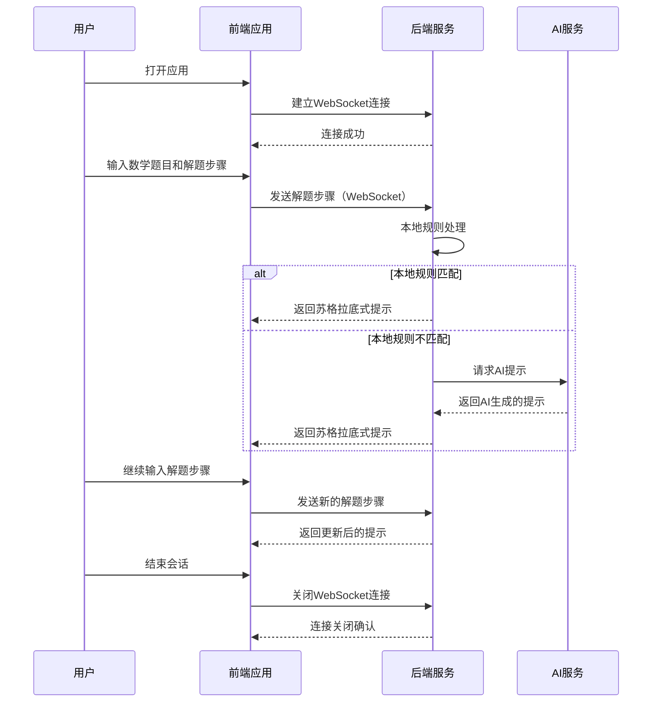

# 端到端测试文档 - 初中数学残局挑战系统

## 1. 测试概述

### 1.1 文档目的

本文档描述了初中数学残局挑战系统的端到端测试方案，旨在验证系统从前端到后端的完整功能流程，确保各组件之间的交互正常，系统能够按照预期工作。

### 1.2 测试范围

端到端测试覆盖以下范围：

- **前端功能**：用户界面、交互流程、WebSocket连接管理
- **后端服务**：HTTP API、WebSocket通信、AI服务集成
- **数据流转**：从用户输入到AI响应的完整数据路径
- **异常处理**：错误情况的处理和反馈

### 1.3 测试类型

- **功能测试**：验证系统的核心功能是否正常工作
- **集成测试**：验证系统各组件之间的交互是否正常
- **用户体验测试**：验证系统的易用性和响应性

## 2. 测试目标

### 2.1 核心目标

1. 验证用户从输入解题步骤到获取苏格拉底式提示的完整流程
2. 确保前端与后端的通信（HTTP和WebSocket）正常
3. 验证AI服务的集成和响应
4. 确保系统在各种情况下的稳定性和可靠性

### 2.2 具体目标

| 目标ID | 目标描述 | 优先级 |
|--------|----------|--------|
| E2E-001 | 验证前端能够成功连接到WebSocket服务 | 高 |
| E2E-002 | 验证用户输入解题步骤后能收到正确的提示 | 高 |
| E2E-003 | 验证系统能处理多种初中数学题型 | 中 |
| E2E-004 | 验证系统能处理异常情况（如无效输入） | 中 |
| E2E-005 | 验证系统的响应时间符合要求 | 中 |
| E2E-006 | 验证WebSocket连接的稳定性 | 中 |

## 3. 测试环境

### 3.1 硬件环境

| 组件 | 配置 |
|------|------|
| 服务器 | 2核4G内存 |
| 客户端 | 现代浏览器，支持WebSocket |

### 3.2 软件环境

| 组件 | 版本 | 地址 |
|------|------|------|
| 后端服务 | FastAPI 0.127.0 | http://localhost:8000 |
| WebSocket服务 | - | ws://localhost:8000/ws |
| 前端应用 | Vue 3.4.21 | http://localhost:5173 |
| 数据库 | SQLite | 本地文件 |

### 3.3 测试工具

| 工具 | 用途 |
|------|------|
| Playwright | 自动化浏览器测试 |
| pytest | Python测试框架 |
| httpx | HTTP请求测试 |
| websockets | WebSocket通信测试 |
| Chrome DevTools | 浏览器调试和网络监控 |

## 4. 测试流程

### 4.1 整体测试流程



### 4.2 测试执行流程

1. **准备阶段**：启动后端服务和前端应用
2. **测试执行**：运行自动化测试脚本或手动执行测试用例
3. **结果收集**：记录测试结果和日志
4. **分析阶段**：分析测试结果，识别问题
5. **报告阶段**：生成测试报告，总结发现的问题

## 5. 详细测试用例

### 5.1 测试用例1：系统启动和连接

| 测试项 | 描述 | 预期结果 | 实际结果 | 状态 |
|--------|------|----------|----------|------|
| TC-E2E-001 | 启动后端服务 | 后端服务成功启动，监听8000端口 | | |
| TC-E2E-002 | 启动前端应用 | 前端应用成功启动，可通过浏览器访问 | | |
| TC-E2E-003 | 前端WebSocket连接 | 前端成功建立WebSocket连接 | | |
| TC-E2E-004 | 健康检查API | 调用健康检查API返回正常状态 | | |

### 5.2 测试用例2：一元一次方程求解

| 测试项 | 描述 | 预期结果 | 实际结果 | 状态 |
|--------|------|----------|----------|------|
| TC-E2E-005 | 输入一元一次方程 | 用户输入方程：2x + 3 = 7 | | |
| TC-E2E-006 | 输入初始解题步骤 | 用户输入："我想先移项" | | |
| TC-E2E-007 | 接收初始提示 | 系统返回苏格拉底式提示 | | |
| TC-E2E-008 | 输入下一步骤 | 用户输入："2x = 7 - 3" | | |
| TC-E2E-009 | 接收下一步提示 | 系统返回更新后的提示 | | |
| TC-E2E-010 | 完成解题 | 用户输入："x = 2" | | |
| TC-E2E-011 | 接收最终反馈 | 系统返回成功反馈 | | |

### 5.3 测试用例3：二元一次方程组求解

| 测试项 | 描述 | 预期结果 | 实际结果 | 状态 |
|--------|------|----------|----------|------|
| TC-E2E-012 | 输入方程组 | 用户输入：
2x + y = 5
x - y = 1 | | |
| TC-E2E-013 | 输入解题思路 | 用户输入："我想使用消元法" | | |
| TC-E2E-014 | 接收提示 | 系统返回苏格拉底式提示 | | |
| TC-E2E-015 | 完成解题 | 用户输入完整解题过程 | | |
| TC-E2E-016 | 接收反馈 | 系统返回详细反馈 | | |

### 5.4 测试用例4：几何证明题

| 测试项 | 描述 | 预期结果 | 实际结果 | 状态 |
|--------|------|----------|----------|------|
| TC-E2E-017 | 输入几何题目 | 用户输入："在△ABC中，AB=AC，证明∠B=∠C" | | |
| TC-E2E-018 | 输入证明思路 | 用户输入："我想使用全等三角形证明" | | |
| TC-E2E-019 | 接收提示 | 系统返回引导性提示 | | |
| TC-E2E-020 | 完成证明 | 用户输入完整证明过程 | | |
| TC-E2E-021 | 接收反馈 | 系统返回证明正确性评价 | | |

### 5.5 测试用例5：异常情况处理

| 测试项 | 描述 | 预期结果 | 实际结果 | 状态 |
|--------|------|----------|----------|------|
| TC-E2E-022 | 无效数学表达式 | 用户输入："1 + 2 = 4" | 系统返回错误提示 | | |
| TC-E2E-023 | 空白输入 | 用户输入空白内容 | 系统返回提示，要求输入有效内容 | | |
| TC-E2E-024 | 恶意输入 | 用户输入特殊字符或过长文本 | 系统正确处理，不崩溃 | | |
| TC-E2E-025 | 网络中断恢复 | 模拟网络中断后恢复 | WebSocket自动重连成功 | | |

## 6. 执行步骤

### 6.1 准备工作

1. **安装依赖**：
   ```bash
   # 后端依赖
   cd backend
   pip install -r requirements.txt
   
   # 前端依赖
   cd ../front
   npm install
   
   # 测试依赖
   cd ..
   pip install playwright pytest httpx websockets
   playwright install
   ```

2. **启动后端服务**：
   ```bash
   cd backend
   python main.py
   ```

3. **启动前端应用**：
   ```bash
   cd ../front
   npm run dev
   ```

### 6.2 手动测试执行

1. **打开浏览器**，访问 `http://localhost:5173`
2. **测试系统启动**：确认应用正常加载，WebSocket连接成功
3. **测试功能流程**：按照测试用例依次执行，记录结果
4. **测试异常情况**：模拟各种异常情况，验证系统处理
5. **记录结果**：将测试结果填入测试用例表格

### 6.3 自动化测试执行

1. **创建自动化测试脚本**：
   ```python
   # tests/e2e/test_e2e.py
   import pytest
   from playwright.sync_api import sync_playwright
   
   @pytest.fixture(scope="session")
   def browser():
       with sync_playwright() as p:
           browser = p.chromium.launch()
           yield browser
           browser.close()
   
   def test_websocket_connection(browser):
       page = browser.new_page()
       page.goto("http://localhost:5173")
       
       # 等待WebSocket连接成功
       page.wait_for_selector(".connection-status.connected")
       
       # 验证连接状态
       connection_status = page.locator(".connection-status").text_content()
       assert "已连接" in connection_status
       
       page.close()
   
   def test_solve_equation(browser):
       page = browser.new_page()
       page.goto("http://localhost:5173")
       
       # 输入数学题目
       page.fill("#equation-input", "2x + 3 = 7")
       
       # 输入解题步骤
       page.fill("#step-input", "我想先移项")
       
       # 提交步骤
       page.click("#submit-step")
       
       # 等待提示生成
       page.wait_for_selector(".hint-content")
       
       # 验证提示内容
       hint = page.locator(".hint-content").text_content()
       assert len(hint) > 0
       
       page.close()
   ```

2. **运行自动化测试**：
   ```bash
   cd /Users/tianpengzhang/playground/endgame
   pytest tests/e2e/test_e2e.py -v
   ```

## 7. 结果分析

### 7.1 测试结果评估

| 结果类型 | 评估标准 |
|----------|----------|
| 通过 | 所有测试用例均按预期执行，无错误 |
| 部分通过 | 大部分测试用例通过，少数次要功能失败 |
| 失败 | 核心功能测试失败，系统无法正常工作 |

### 7.2 性能指标

| 指标 | 目标值 | 实际值 | 状态 |
|------|--------|--------|------|
| 页面加载时间 | < 2秒 | | |
| API响应时间 | < 500ms | | |
| WebSocket连接建立时间 | < 1秒 | | |
| AI提示生成时间 | < 3秒 | | |

### 7.3 问题分类

| 问题类型 | 描述 | 优先级 |
|----------|------|--------|
| 功能缺陷 | 系统功能无法按照预期工作 | 高 |
| 性能问题 | 系统响应缓慢或资源占用过高 | 中 |
| 界面问题 | 用户界面设计不合理或存在错误 | 低 |
| 稳定性问题 | 系统崩溃或连接中断 | 高 |

## 8. 故障排除

### 8.1 常见问题

| 问题 | 可能原因 | 解决方案 |
|------|----------|----------|
| 前端无法连接WebSocket | WebSocket服务未启动或地址错误 | 检查后端服务是否启动，确认WebSocket地址配置正确 |
| API请求返回404 | 后端服务未启动或路由错误 | 检查后端服务状态，确认API路由配置 |
| AI提示生成超时 | 网络问题或AI服务异常 | 检查网络连接，验证AI服务配置 |
| 前端应用无法加载 | 前端服务未启动或依赖未安装 | 启动前端服务，确保所有依赖已安装 |

### 8.2 日志分析

- **后端日志**：位于控制台输出，包含API请求和WebSocket连接信息
- **前端日志**：通过浏览器开发者工具的Console面板查看
- **网络日志**：通过浏览器开发者工具的Network面板查看HTTP和WebSocket通信

## 9. 最佳实践

### 9.1 测试设计原则

1. **覆盖核心功能**：优先测试系统的核心功能
2. **模拟真实场景**：设计接近真实用户使用的测试用例
3. **边界值测试**：测试输入的边界情况
4. **异常情况测试**：测试系统在异常情况下的表现
5. **可重复执行**：确保测试用例可以重复执行，结果一致

### 9.2 测试执行建议

1. **定期执行**：在代码变更后定期执行端到端测试
2. **自动化优先**：尽可能将测试用例自动化，减少手动测试工作量
3. **并行测试**：使用多个浏览器和设备并行测试
4. **持续集成**：将端到端测试集成到CI/CD流程中
5. **结果可视化**：使用测试报告工具生成可视化报告

## 10. 结论

端到端测试是确保初中数学残局挑战系统质量的重要手段，通过全面测试系统的完整流程，可以发现各组件之间的集成问题，确保系统按照预期工作。

本测试文档提供了详细的端到端测试方案，包括测试目标、环境、流程、用例和执行步骤，可以作为测试团队执行端到端测试的指导文档。

通过定期执行端到端测试，可以持续监控系统的质量，及时发现和修复问题，确保系统的稳定性和可靠性，为用户提供良好的使用体验。

## 11. 附录

### 11.1 术语表

| 术语 | 解释 |
|------|------|
| E2E | End-to-End，端到端测试 |
| WebSocket | 一种全双工通信协议 |
| API | Application Programming Interface，应用程序编程接口 |
| AI | Artificial Intelligence，人工智能 |
| 苏格拉底式提示 | 以提问方式引导用户思考的提示 |

### 11.2 参考文档

- [FastAPI文档](https://fastapi.tiangolo.com/)
- [Vue.js文档](https://vuejs.org/)
- [Playwright文档](https://playwright.dev/)
- [WebSocket协议规范](https://datatracker.ietf.org/doc/html/rfc6455)